# 初痕全链路可视化架构图

> Mermaid 图表集。GitHub 原生渲染，直接可看。
> 最后更新：2026-06-09

---

## 一、系统全景

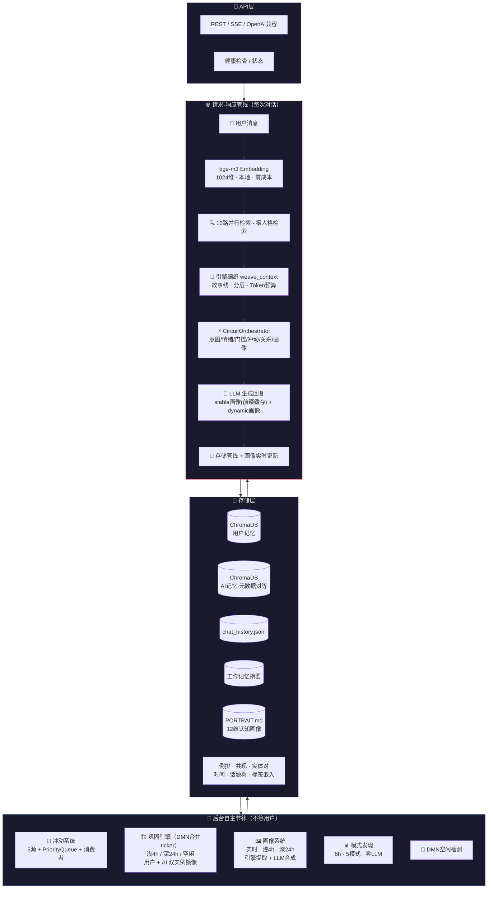

---

## 二、请求-响应管线：一条消息的完整旅程

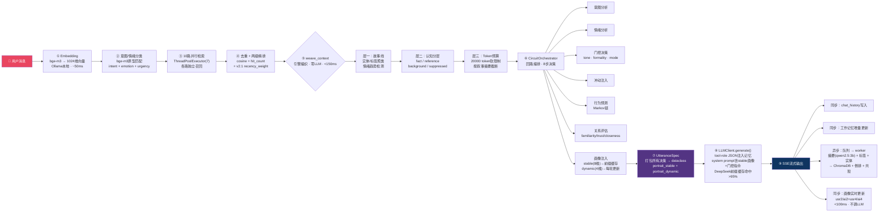

---

## 三、10路并行检索

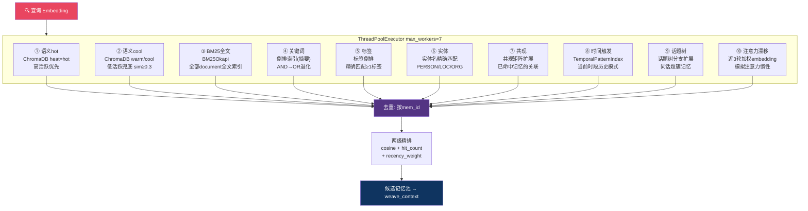

### 意图门控配额

| intent | semantic | tag | entity | time_expand |
|--------|:--------:|:---:|:------:|:-----------:|
| casual | 10 | 5 | 0 | 0 |
| recall | 20 | 8 | 5 | 5 |
| ask_fact | 25 | 10 | 5 | 0 |
| emotional_sharing | 12 | 5 | 0 | 3 |
| conflict | 25 | 10 | 5 | 5 |
| *benchmark* | *×2~5* | *×2~4* | *→10~20* | *→5~10* |

### v2.1 软降权公式

```
recency_weight = 1.0 - (days_ago / 90) × (1.0 - 0.15)   下限 0.15
  · archived 记忆上限 0.6
  · stale    记忆上限 0.3
  · 被报错   记忆 error_count ↑ → score ↓
```

---

## 四、引擎编织 weave_context（四层决策 · 零LLM · <150ms）

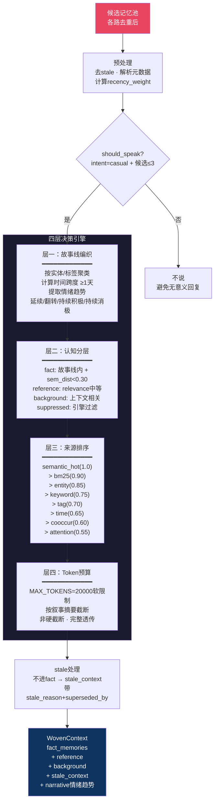

---

## 五、CircuitOrchestrator 回路编排

```mermaid
flowchart LR
    INPUT["WovenContext<br/>+ 用户消息"] --> S1

    subgraph ORCHESTRATOR["CircuitOrchestrator.process() · 8步串行"]
        S1["① 意图分析<br/>━━━━━━━<br/>bge-m3原型匹配<br/>casual/recall/ask_fact/<br/>emotional_sharing/conflict"]
        S1 --> S2["② 情绪分析<br/>━━━━━━━<br/>Russell二维环<br/>valence × arousal<br/>+ intensity(0~1)"]
        S2 --> S3["③ 认知分层<br/>━━━━━━━<br/>MemoryDirective<br/>fact/reference/<br/>background/suppressed"]
        S3 --> S4["④ 门控决策<br/>━━━━━━━<br/>tone · formality<br/>response_mode<br/>suppression理由"]
        S4 --> S5["⑤ 冲动注入<br/>━━━━━━━<br/>PriorityQueue检查<br/>有效优先级≥2<br/>→ ImpulseDirective"]
        S5 --> S6["⑥ 行为预测<br/>━━━━━━━<br/>Markov链<br/>mirror_prediction<br/>下一步意图/话题"]
        S6 --> S7["⑦ 关系评估<br/>━━━━━━━<br/>RelationshipState<br/>familiarity/trust<br/>closeness/mode"]
        S7 --> S8["⑧ 画像注入<br/>━━━━━━━<br/>render_stable(8维)<br/>→ message[0] 前缀缓存<br/>render_dynamic(4维)<br/>→ message[N+1] 每轮更新"]
    end

    S8 --> OUTPUT["UtteranceSpec<br/>全部决策打包 → LLM<br/>portrait_stable + portrait_dynamic"]

    style INPUT fill:#e94560,color:#fff
    style OUTPUT fill:#0f3460,color:#fff
    style ORCHESTRATOR fill:#1a1a2e,stroke:#533483,color:#eee
```

---

## 六、后台自主节律（全线程视图）

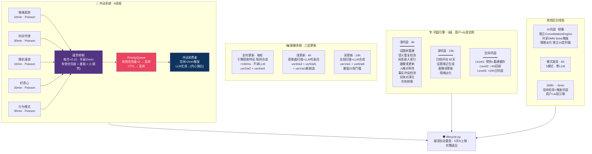

### 内抑制细节

```
疲劳度增长:  每次发射 +0.15
半衰期:      15分钟
抑制阈值:    有效优先级 < 2
TTL过期:     超时自动丢弃
速率限制:    MAX_PER_HOUR / MIN_INTERVAL
```

---

## 七、记忆生命周期

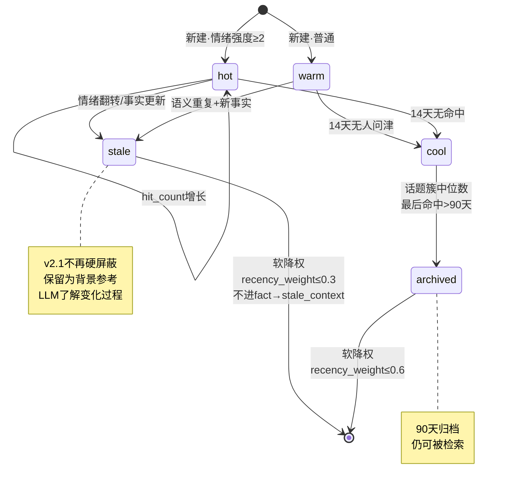

### 情绪衰减（独立于巩固调度器）

```
触发:  每50次 increment_hit_count
条件:  3天未命中 + 高emotional_intensity
效果:  intensity自然衰减
特点:  不依赖巩固调度器，在线路上自然发生
```

---

## 八、存储层全景

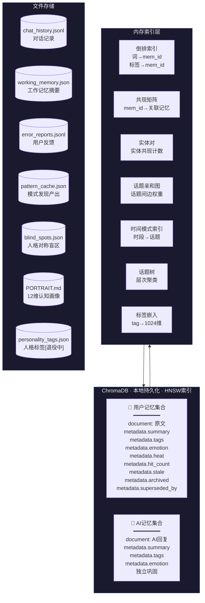

---

## 九、模块依赖图

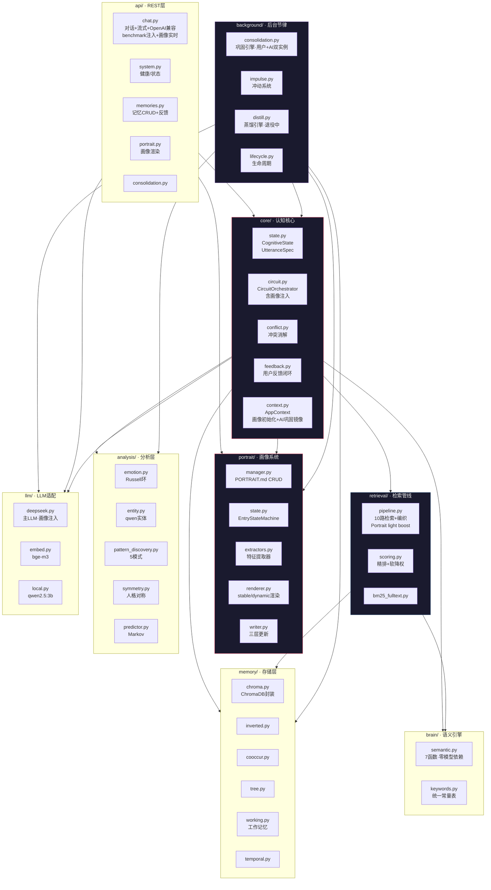

**依赖方向**: `api/ → core/ → brain/ + memory/ → retrieval/ + analysis/ → background/ → llm/`

---

## 十、Prompt 注入结构

```mermaid
flowchart LR
    subgraph SYSTEM_PROMPT_STABLE["System Prompt message[0]（稳定前缀 → DeepSeek缓存命中>95%）"]
        direction TB
        SP1["核心人格 + 工具规则"]
        SP2["stable画像 (8维)<br/>usr1/3/5/6 + ai1/3/5/6"]
        SP3["人格标签 [退役中]"]
        SP4["模式观察"]
        SP5["话题笔记"]
        SP6["引擎调参"]
    end

    subgraph SYSTEM_PROMPT_DYNAMIC["System Prompt message[N+1]（动态 → 每轮更新）"]
        direction TB
        SD1["dynamic画像 (4维)<br/>usr2/4 + ai2/4"]
        SD2["session_context"]
        SD3["now_hint 时间感知"]
    end

    subgraph HISTORY["历史对话 user/assistant"]
        H1["工作记忆摘要 ~3K tokens"]
        H2["最近5轮原文 ~2K tokens"]
    end

    subgraph TOOL_ROLE["Tool Role · 记忆注入（JSON）"]
        direction TB
        M1["fact记忆<br/>relevance高 · 原文完整"]
        M2["reference记忆<br/>relevance中 · 带核实语气"]
        M3["background记忆<br/>调语气 · 不提及"]
        M4["stale_context<br/>stale=true · 了解变化"]
    end

    CURRENT["当前用户消息 user"]

    SYSTEM_PROMPT_STABLE --> HISTORY --> TOOL_ROLE --> SYSTEM_PROMPT_DYNAMIC --> CURRENT

    style SYSTEM_PROMPT_STABLE fill:#1a1a2e,stroke:#0f3460,color:#eee
    style SYSTEM_PROMPT_DYNAMIC fill:#1a1a2e,stroke:#533483,color:#eee
    style TOOL_ROLE fill:#1a1a2e,stroke:#e94560,color:#eee
```

---

## 十一、E2E Benchmark 体系

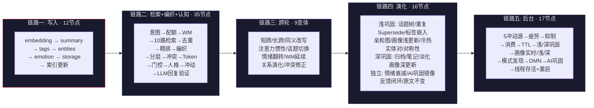

**5 链路 · 各自独立计分 · 不加权合成一个数字**

---

*初痕 · First Beat — 自循环记忆体*
